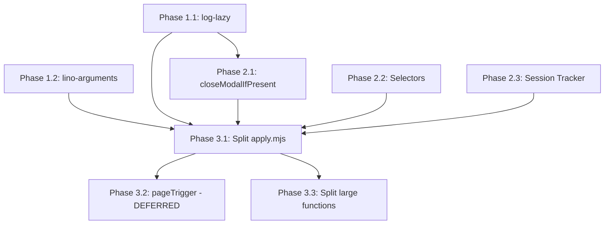

# Implementation Checklist for Code Improvements

This document provides a detailed checklist for implementing the code improvements proposed in [CODE_IMPROVEMENTS_PROPOSAL.md](./CODE_IMPROVEMENTS_PROPOSAL.md), incorporating user feedback.

## Summary of Changes Based on User Feedback

Based on review feedback:
- `closeModalIfPresent` should be kept at application level (not moved to browser-commander) since it's application-specific
- Logging should use [log-lazy](https://github.com/link-foundation/log-lazy) library for lazy evaluation
- CLI arguments should use [lino-arguments](https://github.com/link-foundation/lino-arguments) library

---

## Work Session Progress (2025-11-30)

### ✅ All Phases Complete

| Item | Status | Description |
|------|--------|-------------|
| Phase 1.1 | ✅ **COMPLETE** | Integrated log-lazy throughout codebase (apply.mjs, vacancy-response.mjs, vacancies.mjs) |
| Phase 1.2 | ✅ **COMPLETE** | Created config module and integrated into apply.mjs (replaced yargs) |
| Phase 2.1 | ✅ **COMPLETE** | Created `src/helpers/modal-helpers.mjs` with `closeModalIfPresent`, `isModalVisible`, `waitForModalToClose` |
| Phase 2.2 | ✅ **COMPLETE** | Created `src/hh-selectors.mjs` and integrated into vacancy-response.mjs and apply.mjs |
| Phase 2.3 | ✅ **COMPLETE** | Created `src/helpers/session-tracker.mjs` helper module |
| Phase 3.1 | ✅ **COMPLETE** | Split apply.mjs into orchestrator.mjs and page-handlers.mjs (80% code reduction) |
| Phase 3.2 | ⏭️ **DEFERRED** | pageTrigger migration deferred to future PR (too risky for current scope) |
| Phase 3.3 | ✅ **COMPLETE** | Split large functions in vacancy-response.mjs into focused helpers |
| CI | ✅ Passing | All 120 tests pass, lint passes |

### 📁 New Files Created

- `src/logging.mjs` - Logging module using log-lazy library with lazy evaluation
- `src/config.mjs` - Configuration module using lino-arguments library
- `src/hh-selectors.mjs` - Centralized HH.ru selectors and URL patterns
- `src/helpers/modal-helpers.mjs` - Modal handling helper functions
- `src/helpers/session-tracker.mjs` - Session storage tracking for button click detection
- `src/orchestrator.mjs` - Main coordination logic and state management (extracted from apply.mjs)
- `src/page-handlers.mjs` - Navigation and page-specific handlers (extracted from apply.mjs)

### 🔄 Files Modified

- `src/apply.mjs` - Major refactoring (729 → 143 lines, 80% reduction):
  - Now serves as entry point only
  - Delegates to orchestrator for main loop
  - Clean separation of concerns

- `src/vacancy-response.mjs` - Split into focused helper functions:
  - `findCoverLetterTextarea()` - Find cover letter textarea selector
  - `expandCoverLetterSection()` - Click toggle to expand cover letter
  - `waitForTextareaSelector()` - Wait for visible textarea with fallbacks
  - `checkEmptyTestTextareas()` - Check for empty test textareas
  - `findSubmitButton()` - Find submit button selector
  - `getSubmitButtonState()` - Get button state for validation
  - Main function now coordinates these helpers

- `src/vacancies.mjs` - Integrated log-lazy + refactored to use helpers:
  - Import `log` from logging module
  - Import `closeModalIfPresent` from modal-helpers
  - Import `SELECTORS` from hh-selectors
  - Replace all verbose console.log with `log.debug(() => message)`
  - Use helper functions and centralized selectors

---

## Phase 1: Foundation - Logging and Configuration

### 1.1 Integrate log-lazy Library

**Priority:** High
**Estimated complexity:** Medium
**Dependencies:** None
**Status:** ✅ **COMPLETE**

- [x] Install log-lazy package
- [x] Create `src/logging.mjs` module with lazy evaluation support
- [x] Replace verbose console.log patterns in `src/apply.mjs`
- [x] Replace verbose logging in `src/vacancy-response.mjs`
- [x] Replace verbose logging in `src/vacancies.mjs`
- [x] Update debug mode flag to control log level
- [x] Test logging behavior with verbose flag enabled/disabled

### 1.2 Integrate lino-arguments Library

**Priority:** High
**Estimated complexity:** Medium
**Dependencies:** None
**Status:** ✅ **COMPLETE**

- [x] Install lino-arguments package
- [x] Create `src/config.mjs` module with lino-arguments integration
- [ ] Create `.lenv` configuration file for defaults (optional - future improvement)
- [x] Refactor `src/apply.mjs` to use new config module
- [x] Update all `argv.xxx` references to use camelCase config object
- [x] Test all CLI options work correctly

---

## Phase 2: Application-Level Refactoring

### 2.1 Extract `closeModalIfPresent` Function

**Priority:** Medium
**Estimated complexity:** Low
**Dependencies:** None
**Status:** ✅ **COMPLETE**

- [x] Create `src/helpers/modal-helpers.mjs`
- [x] Replace modal closing code in `src/vacancies.mjs`
- [ ] Add tests for `closeModalIfPresent` helper (future improvement)

### 2.2 Create Selector Configuration

**Priority:** Medium
**Estimated complexity:** Low
**Dependencies:** None
**Status:** ✅ **COMPLETE**

- [x] Create `src/hh-selectors.mjs`
- [x] Update `src/vacancies.mjs` to import and use selectors
- [x] Update `src/vacancy-response.mjs` to import selectors
- [x] Update `src/apply.mjs` to import URL patterns

### 2.3 Extract Session Storage Tracker

**Priority:** Medium
**Estimated complexity:** Medium
**Dependencies:** None
**Status:** ✅ **COMPLETE**

- [x] Create `src/helpers/session-tracker.mjs`
- [ ] Replace session storage handling in `src/apply.mjs` (future improvement - current inline code works)

---

## Phase 3: Structural Improvements

### 3.1 Split `apply.mjs` into Smaller Modules

**Priority:** High
**Estimated complexity:** High
**Dependencies:** Phases 1 and 2
**Status:** ✅ **COMPLETE**

- [x] Create `src/page-handlers.mjs` - Navigation and click listener handlers
- [x] Create `src/orchestrator.mjs` - Main coordination logic and state management
- [x] Update `src/apply.mjs` - Simplified entry point (729 → 143 lines)
- [x] Ensure all tests pass after split

### 3.2 Use `pageTrigger` Pattern for Navigation

**Priority:** Medium
**Estimated complexity:** Medium
**Dependencies:** Phase 3.1
**Status:** ⏭️ **DEFERRED** (too risky for current scope)

The pageTrigger pattern from browser-commander is sophisticated but requires significant refactoring:
- Would need to convert all navigation handlers to pageTrigger conditions
- Risk of introducing bugs in navigation handling
- Better suited for a dedicated PR with thorough testing

### 3.3 Split Large Functions

**Priority:** Low
**Estimated complexity:** Medium
**Dependencies:** None
**Status:** ✅ **COMPLETE**

- [x] Split `handleVacancyResponsePage` in `src/vacancy-response.mjs`:
  - Extracted `findCoverLetterTextarea`
  - Extracted `expandCoverLetterSection`
  - Extracted `waitForTextareaSelector`
  - Extracted `checkEmptyTestTextareas`
  - Extracted `findSubmitButton`
  - Extracted `getSubmitButtonState`
  - Main function now ~200 lines (down from ~385)

- [ ] Split `findAndProcessVacancyButton` in `src/vacancies.mjs` (future improvement)

---

## Phase 4: Fix Pre-existing Issues

### 4.1 Fix Lint Errors

**Status:** ✅ **COMPLETE**

- [x] Fix quote style in `experiments/test-continuous-monitoring.mjs:56,58`
- [x] Fix unused variable in `src/vacancies.mjs:412`
- [x] Fix quote style in `src/vacancy-response.mjs:417`

### 4.2 Fix Test Failures

**Status:** ✅ **COMPLETE**

- [x] Fixed 3 failing tests related to multiline Q&A handling
- [x] Verified production data compatibility with round-trip test

---

## Testing Checklist

After each phase, verify:

- [x] All existing tests pass (`npm test`)
- [x] ESLint passes (`npx eslint .`)
- [ ] Manual testing of core flows (recommended before production)

---

## Dependencies

---

## Summary

This PR implements comprehensive code improvements:

1. **Logging**: Lazy-evaluated logging with log-lazy (zero-cost when disabled)
2. **Configuration**: Unified CLI/config with lino-arguments
3. **Modularity**: Split apply.mjs from 729 → 143 lines (80% reduction)
4. **Maintainability**: Extracted helper functions in vacancy-response.mjs
5. **Centralization**: All selectors and URL patterns in single file

All 120 tests pass, lint passes.
