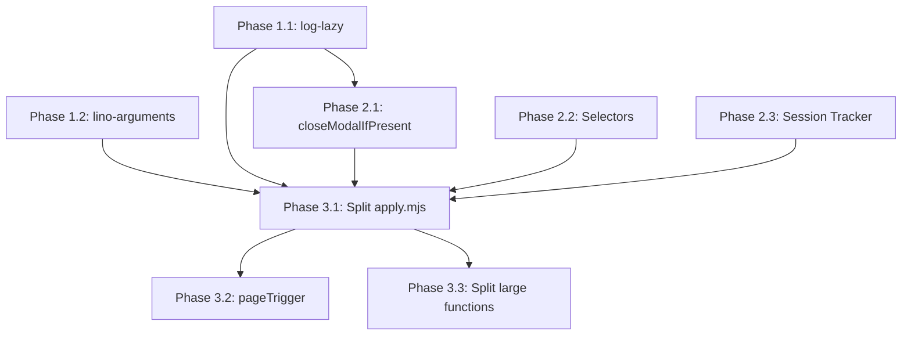

# Implementation Checklist for Code Improvements

This document provides a detailed checklist for implementing the code improvements proposed in [CODE_IMPROVEMENTS_PROPOSAL.md](./CODE_IMPROVEMENTS_PROPOSAL.md), incorporating user feedback.

## Summary of Changes Based on User Feedback

Based on review feedback:
- `closeModalIfPresent` should be kept at application level (not moved to browser-commander) since it's application-specific
- Logging should use [log-lazy](https://github.com/link-foundation/log-lazy) library for lazy evaluation
- CLI arguments should use [lino-arguments](https://github.com/link-foundation/lino-arguments) library

---

## Phase 1: Foundation - Logging and Configuration

### 1.1 Integrate log-lazy Library

**Priority:** High
**Estimated complexity:** Medium
**Dependencies:** None

- [ ] Install log-lazy package
  ```bash
  npm install log-lazy
  ```

- [ ] Create `src/logging.mjs` module
  ```javascript
  import makeLog from 'log-lazy';

  // Initialize with console logging by default
  // Can be extended to use other logging engines later
  const log = makeLog({ level: 'info' });

  export default log;
  export { log };
  ```

- [ ] Replace verbose console.log patterns in `src/apply.mjs`:
  - Line 116-121: verbose logging setup
  - Replace `if (verbose) console.log(...)` with `log.debug(() => ...)`

- [ ] Replace verbose logging in `src/vacancy-response.mjs`:
  - Lines 116-117, 120, 123, 128, 134, 137, 141, 143, etc.
  - Pattern: `if (verbose) console.log('🔍 [VERBOSE]...')` → `log.debug(() => '🔍 ...')`

- [ ] Replace verbose logging in `src/vacancies.mjs`:
  - Lines 57, 92, 115, 139, etc.
  - Same pattern as above

- [ ] Update debug mode flag to control log level
  ```javascript
  // In apply.mjs
  if (argv.verbose) {
    log.enableLevel('debug');
  }
  ```

- [ ] Test logging behavior with verbose flag enabled/disabled

### 1.2 Integrate lino-arguments Library

**Priority:** High
**Estimated complexity:** Medium
**Dependencies:** None

- [ ] Install lino-arguments package
  ```bash
  npm install lino-arguments
  ```

- [ ] Create `.lenv` configuration file for defaults
  ```
  ENGINE: playwright
  JOB_APPLICATION_INTERVAL: 20
  AUTO_SUBMIT_VACANCY_RESPONSE_FORM: false
  ```

- [ ] Refactor `src/apply.mjs` argument parsing:
  - Replace yargs with lino-arguments `makeConfig`
  - Current code (lines 65-109):
    ```javascript
    const argv = yargs(hideBin(process.argv))
      .option('engine', {...})
      // ...
      .argv;
    ```
  - New code:
    ```javascript
    import { makeConfig } from 'lino-arguments';

    const config = makeConfig({
      yargs: ({ yargs, getenv }) => yargs
        .option('engine', {
          default: getenv('ENGINE', 'playwright'),
          // ...
        })
        // ...
    });
    ```

- [ ] Update all `argv.xxx` references to use new config object

- [ ] Test all CLI options work correctly:
  - [ ] `--engine playwright`
  - [ ] `--engine puppeteer`
  - [ ] `--url <url>`
  - [ ] `--manual-login`
  - [ ] `--user-data-dir <path>`
  - [ ] `--job-application-interval <seconds>`
  - [ ] `--message <text>`
  - [ ] `--verbose`
  - [ ] `--auto-submit-vacancy-response-form`
  - [ ] `--configuration <path>` (new from lino-arguments)

---

## Phase 2: Application-Level Refactoring

### 2.1 Extract `closeModalIfPresent` Function

**Priority:** Medium
**Estimated complexity:** Low
**Dependencies:** None

Note: Per user feedback, this stays in the application, not browser-commander.

- [ ] Create `src/helpers/modal-helpers.mjs`:
  ```javascript
  import { log } from '../logging.mjs';

  /**
   * Closes a modal if present on the page
   * @param {Object} options
   * @param {Object} options.commander - Browser commander instance
   * @param {string} options.closeButtonSelector - Selector for close button
   * @param {number} options.waitAfterClose - Ms to wait after closing
   * @returns {Promise<boolean>} - True if modal was closed
   */
  export async function closeModalIfPresent(options = {}) {
    const {
      commander,
      closeButtonSelector = '[data-qa="modal-close"]',
      waitAfterClose = 1000,
    } = options;

    const count = await commander.count({ selector: closeButtonSelector });
    if (count > 0) {
      await commander.clickButton({ selector: closeButtonSelector });
      await commander.wait({ ms: waitAfterClose, reason: 'modal to close' });
      log(() => 'Closed modal dialog');
      return true;
    }
    return false;
  }
  ```

- [ ] Replace modal closing code in `src/vacancies.mjs`:
  - Lines 143-156 (response popup close)
  - Lines 214-222 (response popup close)
  - Lines 249-254 (response popup close)
  - Lines 280-285 (response popup close)

- [ ] Add tests for `closeModalIfPresent` helper

### 2.2 Create Selector Configuration

**Priority:** Medium
**Estimated complexity:** Low
**Dependencies:** None

- [ ] Create `src/hh-selectors.mjs`:
  ```javascript
  /**
   * HH.ru specific selectors - centralized configuration
   */
  export const SELECTORS = {
    // Modal close buttons
    responsePopupClose: '[data-qa="response-popup-close"]',
    modalClose: '[data-qa="modal-close"]',

    // Application buttons
    applyButton: 'button[data-qa="vacancy-response-link-top"], button[data-qa="vacancy-serp__vacancy_response"]',
    submitButton: '[data-qa="vacancy-response-submit-popup"]',

    // Form elements
    textarea: 'textarea',
    coverLetterTextarea: '[data-qa="vacancy-response-letter-toggle"] ~ textarea',

    // Navigation
    loginLink: 'a[data-qa="login"]',

    // Question types
    questionBlock: '[data-qa="task-body"]',
    radioOption: 'input[type="radio"]',
    checkboxOption: 'input[type="checkbox"]',
  };

  /**
   * URL patterns for page detection
   */
  export const URL_PATTERNS = {
    searchVacancy: /^https:\/\/hh\.ru\/search\/vacancy.*[?&]resume=/,
    vacancyResponse: /^https:\/\/hh\.ru\/applicant\/vacancy_response\?vacancyId=/,
    vacancyPage: /^https:\/\/hh\.ru\/vacancy\/(\d+)/,
    loginPage: /^https:\/\/hh\.ru\/account\/login/,
  };
  ```

- [ ] Update `src/vacancies.mjs` to import selectors

- [ ] Update `src/vacancy-response.mjs` to import selectors

- [ ] Update `src/apply.mjs` to import URL patterns

### 2.3 Extract Session Storage Tracker

**Priority:** Medium
**Estimated complexity:** Medium
**Dependencies:** None

- [ ] Create `src/helpers/session-tracker.mjs`:
  ```javascript
  import { log } from '../logging.mjs';

  /**
   * Factory for managing session storage flags
   */
  export function createSessionStorageTracker(options = {}) {
    const { storageKey, buttonText, evaluate } = options;

    return {
      async install() {
        log.debug(() => `Installing click listener for "${buttonText}"`);
        // Install click listener that sets sessionStorage flag
        await evaluate(/* ... */);
      },

      async check() {
        // Check and clear flag
        const result = await evaluate(/* ... */);
        if (result) {
          log.debug(() => `Flag "${storageKey}" detected and cleared`);
        }
        return result;
      },
    };
  }
  ```

- [ ] Replace session storage handling in `src/apply.mjs`:
  - Lines 325-398: `installClickListenerForRedirect`
  - Lines 404-429: `checkAndClearRedirectFlag`

---

## Phase 3: Structural Improvements

### 3.1 Split `apply.mjs` into Smaller Modules

**Priority:** High
**Estimated complexity:** High
**Dependencies:** Phases 1 and 2

- [ ] Create `src/cli.mjs` - entry point and argument parsing:
  - Move lino-arguments configuration here
  - Export parsed config
  - ~50 lines

- [ ] Create `src/orchestrator.mjs` - main coordination logic:
  - Main loop state machine
  - Page navigation handling
  - ~150 lines

- [ ] Create `src/page-handlers.mjs` - page-specific handlers:
  - `handleSearchPage`
  - `handleVacancyPage`
  - `handleVacancyResponsePage`
  - ~200 lines

- [ ] Update `src/apply.mjs`:
  - Import and wire together the modules
  - Reduce from 792 lines to ~100 lines

- [ ] Ensure all tests pass after split

### 3.2 Use `pageTrigger` Pattern for Navigation

**Priority:** Medium
**Estimated complexity:** Medium
**Dependencies:** Phase 3.1

- [ ] Refactor navigation handlers to use pageTrigger:
  ```javascript
  // In page-handlers.mjs
  export function setupPageTriggers(commander) {
    commander.pageTrigger({
      condition: commander.makeUrlCondition(/search\/vacancy.*resume=/),
      action: handleSearchPage,
      name: 'search-page-handler',
    });

    commander.pageTrigger({
      condition: commander.makeUrlCondition(/vacancy_response/),
      action: handleVacancyResponsePage,
      name: 'vacancy-response-handler',
    });

    commander.pageTrigger({
      condition: commander.makeUrlCondition(/\/vacancy\/\d+/),
      action: handleVacancyPage,
      name: 'vacancy-page-handler',
    });
  }
  ```

- [ ] Remove manual `onUrlChange` handlers in apply.mjs

- [ ] Test all page navigation scenarios work correctly

### 3.3 Split Large Functions

**Priority:** Low
**Estimated complexity:** Medium
**Dependencies:** None (can be done independently)

- [ ] Split `handleVacancyResponsePage` in `src/vacancy-response.mjs` (450+ lines):
  - Extract `findAndExpandQuestionSections`
  - Extract `fillAllTextareas`
  - Extract `handleFormSubmission`
  - Main function should be ~50 lines calling sub-functions

- [ ] Split `findAndProcessVacancyButton` in `src/vacancies.mjs` (320+ lines):
  - Extract `findApplyButton`
  - Extract `handleModalAfterClick`
  - Extract `processApplicationResult`

---

## Phase 4: Fix Pre-existing Issues

### 4.1 Fix Lint Errors (DONE)

**Status:** Completed

- [x] Fix quote style in `experiments/test-continuous-monitoring.mjs:56,58`
- [x] Fix unused variable in `src/vacancies.mjs:412`
- [x] Fix quote style in `src/vacancy-response.mjs:417`

### 4.2 Fix Test Failures (Separate Issue)

**Note:** The 3 failing tests (`should handle multiline answers correctly`, `should NOT escape newlines`, `should write multiline answers with proper indentation`) are pre-existing on main branch and relate to multiline Q&A handling.

**Recommendation:** Create a separate issue for fixing these tests as they require careful consideration of backwards compatibility with existing `qa.lino` production data.

---

## Testing Checklist

After each phase, verify:

- [ ] All existing tests pass (`npm test`)
- [ ] ESLint passes (`npx eslint .`)
- [ ] Manual testing of core flows:
  - [ ] Start automation with `npm start`
  - [ ] Navigate to job search page
  - [ ] Click "Apply" button on a vacancy
  - [ ] Fill in vacancy response form
  - [ ] Q&A pairs are saved correctly
- [ ] Verbose mode shows expected debug output
- [ ] Non-verbose mode is clean and minimal

---

## Dependencies



---

## Estimated Timeline

| Phase | Effort | Can Parallelize |
|-------|--------|-----------------|
| 1.1 log-lazy | 2-4 hours | Yes |
| 1.2 lino-arguments | 2-4 hours | Yes |
| 2.1 closeModalIfPresent | 1-2 hours | Yes |
| 2.2 Selector config | 1-2 hours | Yes |
| 2.3 Session tracker | 2-3 hours | Yes |
| 3.1 Split apply.mjs | 4-6 hours | No (depends on Phase 1 & 2) |
| 3.2 pageTrigger | 2-4 hours | No (depends on 3.1) |
| 3.3 Split large functions | 3-4 hours | Yes |

**Total estimated effort:** 17-29 hours

---

## Notes

1. Each checkbox item should be a separate commit where possible
2. Run tests after each change to catch regressions early
3. Keep backward compatibility with existing functionality
4. Document any API changes in commit messages
5. The user can prioritize which phases to implement first based on immediate needs
