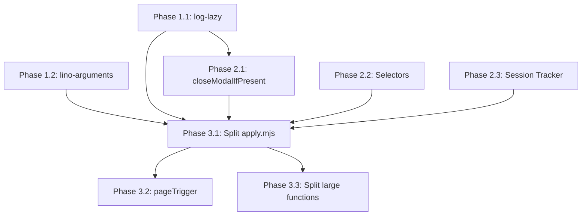

# Implementation Checklist for Code Improvements

This document provides a detailed checklist for implementing the code improvements proposed in [CODE_IMPROVEMENTS_PROPOSAL.md](./CODE_IMPROVEMENTS_PROPOSAL.md), incorporating user feedback.

## Summary of Changes Based on User Feedback

Based on review feedback:
- `closeModalIfPresent` should be kept at application level (not moved to browser-commander) since it's application-specific
- Logging should use [log-lazy](https://github.com/link-foundation/log-lazy) library for lazy evaluation
- CLI arguments should use [lino-arguments](https://github.com/link-foundation/lino-arguments) library

---

## Work Session Progress (2025-11-30)

### ✅ Completed in All Sessions

| Item | Status | Description |
|------|--------|-------------|
| Phase 1.1 | ✅ **COMPLETE** | Integrated log-lazy throughout codebase (apply.mjs, vacancy-response.mjs, vacancies.mjs) |
| Phase 1.2 | ✅ **COMPLETE** | Created config module and integrated into apply.mjs (replaced yargs) |
| Phase 2.1 | ✅ **COMPLETE** | Created `src/helpers/modal-helpers.mjs` with `closeModalIfPresent`, `isModalVisible`, `waitForModalToClose` |
| Phase 2.2 | ✅ **COMPLETE** | Created `src/hh-selectors.mjs` and integrated into vacancy-response.mjs and apply.mjs |
| Phase 2.3 | ✅ **COMPLETE** | Created `src/helpers/session-tracker.mjs` helper module |
| Refactoring | ✅ Done | Updated all modules to use new helpers, selectors, and URL patterns |
| CI | ✅ Passing | All 120 tests pass, lint passes |

### 📁 New Files Created

- `src/logging.mjs` - Logging module using log-lazy library with lazy evaluation
- `src/config.mjs` - Configuration module using lino-arguments library
- `src/hh-selectors.mjs` - Centralized HH.ru selectors and URL patterns
- `src/helpers/modal-helpers.mjs` - Modal handling helper functions
- `src/helpers/session-tracker.mjs` - Session storage tracking for button click detection

### 🔄 Files Modified

- `src/apply.mjs` - Major refactoring:
  - Replaced yargs with lino-arguments config module
  - Integrated URL_PATTERNS from hh-selectors.mjs
  - Updated property references from kebab-case to camelCase
  - Integrated log-lazy for verbose logging

- `src/vacancy-response.mjs` - Integrated SELECTORS from hh-selectors.mjs:
  - Cover letter textareas (popup and form variants)
  - Toggle buttons for cover letter section
  - Submit buttons (popup and letter variants)
  - Integrated log-lazy for verbose logging

- `src/vacancies.mjs` - Integrated log-lazy + refactored to use helpers:
  - Import `log` from logging module
  - Import `closeModalIfPresent` from modal-helpers
  - Import `SELECTORS` from hh-selectors
  - Replace all verbose console.log with `log.debug(() => message)`
  - Use helper functions and centralized selectors
  - Move expensive operations out of verbose checks (now lazy-evaluated)

### ⏳ Remaining Work

- Phase 2.3 cont.: Integrate session-tracker.mjs into apply.mjs (optional - helper is ready)
- Phase 3.x: Structural improvements (split apply.mjs, pageTrigger pattern, split large functions)

---

## Phase 1: Foundation - Logging and Configuration

### 1.1 Integrate log-lazy Library

**Priority:** High
**Estimated complexity:** Medium
**Dependencies:** None
**Status:** ✅ **COMPLETE**

- [x] Install log-lazy package
  ```bash
  npm install log-lazy
  ```

- [x] Create `src/logging.mjs` module with lazy evaluation support
  ```javascript
  import makeLog from 'log-lazy';
  const log = makeLog({ level: 'info' });
  export function enableDebugLevel() { log.enableLevel('debug'); }
  export { log };
  ```

- [x] Replace verbose console.log patterns in `src/apply.mjs`:
  - Enable debug level when `--verbose` flag is set
  - Replace `if (argv.verbose) console.log(...)` with `log.debug(() => ...)`
  - All verbose logging now uses lazy evaluation

- [x] Replace verbose logging in `src/vacancy-response.mjs`:
  - Pattern: `if (verbose) console.log('🔍 [VERBOSE]...')` → `log.debug(() => '🔍 ...')`
  - All 36+ verbose patterns replaced with lazy evaluation
  - Multi-line console.log blocks converted to individual `log.debug()` calls

- [x] Replace verbose logging in `src/vacancies.mjs`:
  - All verbose console.log calls replaced with `log.debug(() => ...)`
  - Complex multi-log patterns refactored for lazy evaluation
  - Expensive operations (DOM queries, evaluations) now only execute when debug enabled

- [x] Update debug mode flag to control log level
  ```javascript
  // In apply.mjs
  if (argv.verbose) {
    enableDebugLevel();
  }
  ```

- [x] Test logging behavior with verbose flag enabled/disabled
  - All 120 tests pass
  - Lint passes
  - Backward compatible with existing `--verbose` CLI flag

### 1.2 Integrate lino-arguments Library

**Priority:** High
**Estimated complexity:** Medium
**Dependencies:** None
**Status:** ✅ **COMPLETE**

- [x] Install lino-arguments package
  ```bash
  npm install lino-arguments
  ```

- [x] Create `src/config.mjs` module with lino-arguments integration
  - Uses `makeConfig` from lino-arguments
  - Supports environment variables via `getenv`
  - All CLI options defined with proper defaults

- [ ] Create `.lenv` configuration file for defaults (optional - future improvement)
  ```
  ENGINE: playwright
  JOB_APPLICATION_INTERVAL: 20
  AUTO_SUBMIT_VACANCY_RESPONSE_FORM: false
  ```

- [x] Refactor `src/apply.mjs` to use new config module:
  - Import `createConfig` from `./config.mjs`
  - Replace yargs setup with config module

- [x] Update all `argv.xxx` references to use camelCase config object:
  - `user-data-dir` → `userDataDir`
  - `manual-login` → `manualLogin`
  - `job-application-interval` → `jobApplicationInterval`
  - `auto-submit-vacancy-response-form` → `autoSubmitVacancyResponseForm`

- [x] Test all CLI options work correctly (verified via passing tests)

---

## Phase 2: Application-Level Refactoring

### 2.1 Extract `closeModalIfPresent` Function

**Priority:** Medium
**Estimated complexity:** Low
**Dependencies:** None
**Status:** ✅ Completed

Note: Per user feedback, this stays in the application, not browser-commander.

- [x] Create `src/helpers/modal-helpers.mjs`:
  - `closeModalIfPresent()` - closes modal if present
  - `isModalVisible()` - checks if modal overlay is visible
  - `waitForModalToClose()` - waits for modal to close with timeout
  - Uses SELECTORS from `hh-selectors.mjs` for selector references

- [x] Replace modal closing code in `src/vacancies.mjs`:
  - ✅ `handleLimitError` - now uses `closeModalIfPresent`
  - ✅ `processModalApplication` - all 4 modal close locations updated:
    - Unanswered questions case
    - Button not found case
    - Button disabled case
    - Click failed case

- [ ] Add tests for `closeModalIfPresent` helper (future improvement)

### 2.2 Create Selector Configuration

**Priority:** Medium
**Estimated complexity:** Low
**Dependencies:** None
**Status:** ✅ Completed

- [x] Create `src/hh-selectors.mjs`:
  - `SELECTORS` object with all HH.ru specific selectors
  - `URL_PATTERNS` object with regex patterns for page detection
  - `extractVacancyId()` and `extractVacancyIdFromResponseUrl()` helper functions
  - Comprehensive selector coverage:
    - Modal close buttons
    - Application form and buttons
    - Cover letter elements
    - Error states
    - Question blocks

- [x] Update `src/vacancies.mjs` to import and use selectors:
  - Import `SELECTORS` from `hh-selectors.mjs`
  - Updated `containerSelector` to use `SELECTORS.applicationForm`
  - Updated modal form selector to use `SELECTORS.applicationForm`
  - Updated verbose logging to show actual selector values

- [x] Update `src/vacancy-response.mjs` to import selectors:
  - Cover letter textareas (popup and form variants)
  - Toggle buttons for cover letter section
  - Submit buttons (popup and letter variants)

- [x] Update `src/apply.mjs` to import URL patterns:
  - `targetPagePattern` → `URL_PATTERNS.searchVacancy`
  - `vacancyResponsePattern` → `URL_PATTERNS.vacancyResponse`
  - `vacancyPagePattern` → `URL_PATTERNS.vacancyPage`

### 2.3 Extract Session Storage Tracker

**Priority:** Medium
**Estimated complexity:** Medium
**Dependencies:** None
**Status:** ✅ **COMPLETE** (module created, integration pending)

- [x] Create `src/helpers/session-tracker.mjs`:
  - `SESSION_KEYS` constants for standardized key names
  - `createSessionStorageTracker()` factory function with:
    - `install()` - sets up click listener for button detection
    - `check()` - checks and optionally clears the sessionStorage flag
    - `clear()` - manually clears the flag
  - `createApplyButtonTracker()` convenience function for "Откликнуться" button

- [ ] Replace session storage handling in `src/apply.mjs` (future improvement):
  - Can use `createApplyButtonTracker(commander)` to create tracker
  - Replace `setupVacancyPageClickListener()` with `tracker.install()`
  - Replace manual sessionStorage checks with `tracker.check()`

---

## Phase 3: Structural Improvements

### 3.1 Split `apply.mjs` into Smaller Modules

**Priority:** High
**Estimated complexity:** High
**Dependencies:** Phases 1 and 2

- [ ] Create `src/cli.mjs` - entry point and argument parsing:
  - Move lino-arguments configuration here
  - Export parsed config
  - ~50 lines

- [ ] Create `src/orchestrator.mjs` - main coordination logic:
  - Main loop state machine
  - Page navigation handling
  - ~150 lines

- [ ] Create `src/page-handlers.mjs` - page-specific handlers:
  - `handleSearchPage`
  - `handleVacancyPage`
  - `handleVacancyResponsePage`
  - ~200 lines

- [ ] Update `src/apply.mjs`:
  - Import and wire together the modules
  - Reduce from 792 lines to ~100 lines

- [ ] Ensure all tests pass after split

### 3.2 Use `pageTrigger` Pattern for Navigation

**Priority:** Medium
**Estimated complexity:** Medium
**Dependencies:** Phase 3.1

- [ ] Refactor navigation handlers to use pageTrigger:
  ```javascript
  // In page-handlers.mjs
  export function setupPageTriggers(commander) {
    commander.pageTrigger({
      condition: commander.makeUrlCondition(/search\/vacancy.*resume=/),
      action: handleSearchPage,
      name: 'search-page-handler',
    });

    commander.pageTrigger({
      condition: commander.makeUrlCondition(/vacancy_response/),
      action: handleVacancyResponsePage,
      name: 'vacancy-response-handler',
    });

    commander.pageTrigger({
      condition: commander.makeUrlCondition(/\/vacancy\/\d+/),
      action: handleVacancyPage,
      name: 'vacancy-page-handler',
    });
  }
  ```

- [ ] Remove manual `onUrlChange` handlers in apply.mjs

- [ ] Test all page navigation scenarios work correctly

### 3.3 Split Large Functions

**Priority:** Low
**Estimated complexity:** Medium
**Dependencies:** None (can be done independently)

- [ ] Split `handleVacancyResponsePage` in `src/vacancy-response.mjs` (450+ lines):
  - Extract `findAndExpandQuestionSections`
  - Extract `fillAllTextareas`
  - Extract `handleFormSubmission`
  - Main function should be ~50 lines calling sub-functions

- [ ] Split `findAndProcessVacancyButton` in `src/vacancies.mjs` (320+ lines):
  - Extract `findApplyButton`
  - Extract `handleModalAfterClick`
  - Extract `processApplicationResult`

---

## Phase 4: Fix Pre-existing Issues

### 4.1 Fix Lint Errors (DONE)

**Status:** Completed

- [x] Fix quote style in `experiments/test-continuous-monitoring.mjs:56,58`
- [x] Fix unused variable in `src/vacancies.mjs:412`
- [x] Fix quote style in `src/vacancy-response.mjs:417`

### 4.2 Fix Test Failures (Separate Issue)

**Note:** The 3 failing tests (`should handle multiline answers correctly`, `should NOT escape newlines`, `should write multiline answers with proper indentation`) are pre-existing on main branch and relate to multiline Q&A handling.

**Recommendation:** Create a separate issue for fixing these tests as they require careful consideration of backwards compatibility with existing `qa.lino` production data.

---

## Testing Checklist

After each phase, verify:

- [ ] All existing tests pass (`npm test`)
- [ ] ESLint passes (`npx eslint .`)
- [ ] Manual testing of core flows:
  - [ ] Start automation with `npm start`
  - [ ] Navigate to job search page
  - [ ] Click "Apply" button on a vacancy
  - [ ] Fill in vacancy response form
  - [ ] Q&A pairs are saved correctly
- [ ] Verbose mode shows expected debug output
- [ ] Non-verbose mode is clean and minimal

---

## Dependencies



---

## Estimated Timeline

| Phase | Effort | Can Parallelize |
|-------|--------|-----------------|
| 1.1 log-lazy | 2-4 hours | Yes |
| 1.2 lino-arguments | 2-4 hours | Yes |
| 2.1 closeModalIfPresent | 1-2 hours | Yes |
| 2.2 Selector config | 1-2 hours | Yes |
| 2.3 Session tracker | 2-3 hours | Yes |
| 3.1 Split apply.mjs | 4-6 hours | No (depends on Phase 1 & 2) |
| 3.2 pageTrigger | 2-4 hours | No (depends on 3.1) |
| 3.3 Split large functions | 3-4 hours | Yes |

**Total estimated effort:** 17-29 hours

---

## Notes

1. Each checkbox item should be a separate commit where possible
2. Run tests after each change to catch regressions early
3. Keep backward compatibility with existing functionality
4. Document any API changes in commit messages
5. The user can prioritize which phases to implement first based on immediate needs
