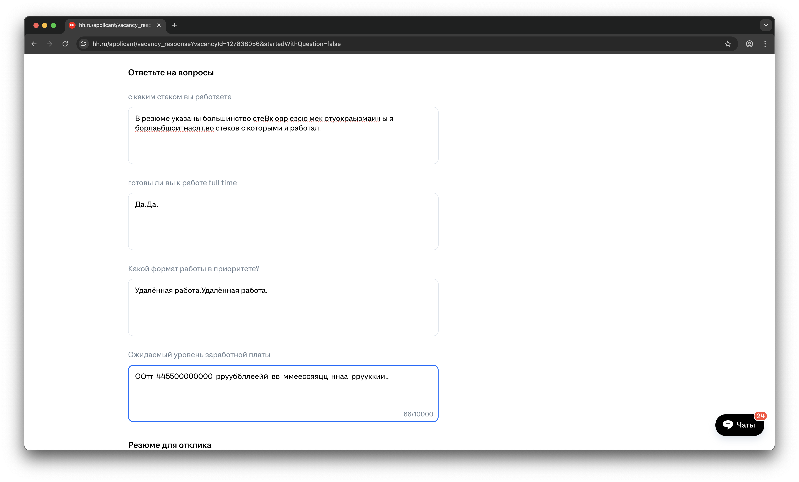

# Case Study: Issue #115 - Multiple Textarea Filling Problems

## Issue Summary

- **Issue**: #115
- **Problem**: Multiple problems with filling textareas simultaneously, including text duplication, character corruption, and failure to fill non-empty textareas
- **Context**: HH.ru job application forms with multiple question textareas
- **Date**: 2025-12-01
- **Related Issues**: #80 (textarea with answer to question is not really filled)
- **Related Commits**:
  - `15d0114` - Fix concurrent textarea typing by using unique selectors
  - Multiple issue #80 fixes and experiments

## Visual Evidence

The screenshot provided in issue #115 shows clear evidence of the problems:



### Observed Problems in Screenshot:

1. **First textarea** (about tech stack) - Filled correctly with detailed text
2. **Second textarea** (about full-time readiness) - Shows **text duplication**: "Да.Да." (Yes. Yes.) - same text repeated twice
3. **Third textarea** (about work format priority) - Shows **text duplication**: "Удалённая работа Удалённая работа." (Remote work Remote work.) - duplicated text
4. **Fourth textarea** (about expected salary) - Shows **severe character corruption**: "ООт 445500000000 ррууббллнееййй вв ммеессяящщ ннаа рруукккии.." - Characters are doubled and garbled

The pattern is clear: text is being typed into textareas concurrently, causing characters to interleave and create garbled output.

## Timeline of Events

### Historical Context

#### Phase 1: Issue #80 - Basic Textarea Filling Problem (Earlier)

**Problem**: Textareas with answers to questions were not being filled properly. The textarea would have a value set, but the UI would not update correctly (label "Писать тут" would remain visible, indicating the framework didn't recognize the content).

**Analysis Files Created**:
- `experiments/analyze-issue-80-framework.mjs` - Analysis of HH.ru's Magritte framework
- `experiments/test-issue-80-textarea-filling.mjs` - Testing different filling methods
- `experiments/test-issue-80-accurate-simulation.mjs` - Accurate simulation of HH.ru structure
- `experiments/test-issue-80-fix-verification.mjs` - Verification of the fix

**Root Cause**: Direct value assignment (`textarea.value = text`) + manual event dispatch was not sufficient for HH.ru's Magritte UI framework to recognize the content change.

**Solution**: Changed from direct value assignment to using `click()` + `type()` to simulate real user interaction:
```javascript
// Before:
textarea.value = knownAnswer;
textarea.dispatchEvent(inputEvent);

// After:
await textarea.click();
await textarea.type(knownAnswer);
```

This is implemented in `src/browser-commander/interactions/fill.js` via the `fillTextArea()` function with `simulateTyping: true`.

#### Phase 2: Concurrent Typing Problem (Recent - Commit 15d0114)

**Problem**: Multiple textareas being filled simultaneously caused text interleaving and character corruption.

**Symptoms**:
- Text from one textarea appearing in another
- Character duplication (each character typed twice)
- Garbled output like "ООт 445500000000 ррууббллнееййй"

**Root Cause**: The selector generation in `extractPageQuestions()` used global textarea indices (`textarea:nth-of-type(N)`), which could match the wrong textarea when multiple filling operations ran concurrently.

**Timeline**:
```
1. extractPageQuestions() generates selectors using global index
2. Multiple textareas queued for filling
3. fillTextArea() called concurrently for cover letter and Q&A textareas
4. Playwright converts `textarea:nth-of-type(N)` to `page.locator('textarea').nth(N-1)`
5. Race condition: Both operations might target the same textarea
6. Characters from both operations interleave
```

**Solution** (Commit 15d0114 - 2025-12-01):
```javascript
// Before: Global index-based selector
const selector = textarea.name ?
  `textarea[name="${textarea.name}"]` :
  `textarea:nth-of-type(${index + 1})`;

// After: Unique attribute-based selectors
let selector;
if (textarea.name) {
  selector = `textarea[name="${textarea.name}"]`;
} else if (textarea.id) {
  selector = `textarea#${textarea.id}`;
} else {
  // Fallback: Add temporary unique attribute
  const uniqueId = `qa-temp-${Date.now()}-${taskIndex}`;
  textarea.setAttribute('data-qa-temp-id', uniqueId);
  selector = `textarea[data-qa-temp-id="${uniqueId}"]`;
}
```

## Root Cause Analysis

### Problem 1: Concurrent Textarea Targeting

**The Bug**: Weak selector generation using global textarea indices

**File**: `src/qa.mjs:27` (before fix)

**Original Code**:
```javascript
const textareas = document.querySelectorAll('textarea');
textareas.forEach((textarea, index) => {
  // ...
  const selector = textarea.name ?
    `textarea[name="${textarea.name}"]` :
    `textarea:nth-of-type(${index + 1})`;
});
```

**Why This Failed**:

1. **Global Index Problem**: Index is counted across ALL textareas on page, including:
   - Cover letter textarea (index 0)
   - Question textareas (indices 1, 2, 3, ...)

2. **Selector Conversion Issues**: When Playwright converts `textarea:nth-of-type(3)` to its internal locator, it uses `page.locator('textarea').nth(2)`, which can match a different element if:
   - DOM structure changes during typing
   - Elements are dynamically added/removed
   - Race conditions occur between concurrent operations

3. **Concurrent Filling**: Both cover letter and Q&A textareas fill simultaneously:
   ```
   Thread 1: Fill cover letter -> targets textarea:nth-of-type(1)
   Thread 2: Fill Q&A answer   -> targets textarea:nth-of-type(2)

   But if selectors resolve at slightly different times, both might
   target the same element, causing character interleaving.
   ```

### Problem 2: Text Not Filling Non-Empty Textareas

**The Bug**: `checkEmpty` parameter in `fillTextArea()` defaults to `true`

**File**: `src/browser-commander/interactions/fill.js:240`

**Code**:
```javascript
export async function fillTextArea(options = {}) {
  const {
    // ...
    checkEmpty = true,  // ← This prevents filling if textarea has content
    // ...
  } = options;

  // Check if empty (if requested)
  if (checkEmpty) {
    const isEmpty = await checkIfElementEmpty({ page, engine, locatorOrElement });
    if (!isEmpty) {
      const currentValue = await getInputValue({ page, engine, locatorOrElement });
      log.debug(() => `Textarea already has content, skipping: "${currentValue}"`);
      return { filled: false, verified: false, skipped: true, actualValue: currentValue };
    }
  }
}
```

**Why This Is a Problem**:

If a textarea already has content (from a previous partial fill, or from the concurrent typing bug), subsequent attempts to fill it will be skipped. This means:
1. User sees corrupted text
2. System detects "content exists"
3. System skips re-filling
4. Corrupted text remains

## Call Chain Analysis

### How Textareas Are Filled

```
1. handleVacancyResponsePage() [src/vacancy-response.mjs]
   ↓
2. setupQAHandling() [src/vacancy-response.mjs:23]
   ↓
3. extractPageQuestions() [src/qa.mjs:12]
   - Generates selectors for all textareas
   - BUG WAS HERE: Used global indices
   ↓
4. fillTextareaQuestion() [src/qa.mjs:310]
   ↓
5. commander.fillTextArea() [bindings layer]
   ↓
6. fillTextArea() [src/browser-commander/interactions/fill.js:232]
   ↓
7. clickElement() + performFill() [fill.js:279, 285]
   - Actually types the text character by character
```

### Concurrent Operations

The code fills textareas concurrently in a loop:

```javascript
// src/vacancy-response.mjs:48
for (const [question, data] of questionToAnswer) {
  try {
    if (data.type === 'textarea') {
      await fillTextareaQuestion({ commander, questionData: data, verbose });
    }
    // ...
  } catch (error) {
    console.error(`Error autofilling for "${question}":`, error.message);
  }
}
```

**Key Point**: While each individual `fillTextareaQuestion()` is `await`ed, if multiple questions have textareas and the filling is fast, there can be slight overlap in the timing, especially if:
- Network delays vary
- DOM mutations occur
- Other async operations interfere

However, the REAL concurrent filling happens when:
1. Cover letter is being filled (from `handleVacancyResponsePage:402`)
2. Q&A textareas start filling (from `setupQAHandling:50`)

Both operations use `fillTextArea()` concurrently, and if selectors are not unique, they can target the same element.

## HH.ru Textarea Framework (Magritte)

### HTML Structure

```html
<div data-qa="textarea-wrapper" class="magritte-textarea___ugvor_3-1-14">
  <div class="magritte-textarea-position-container-wrapper___4Dsui_3-1-14">
    <div class="magritte-textarea-position-container___cEpbv_3-1-14">
      <div class="magritte-textarea-wrapper___yD7G6_3-1-14" data-qa="textarea-native-wrapper">
        <textarea name="task_300580794_text" class="magritte-native-element___a0RAE_3-1-14">
        </textarea>
        <div class="magritte-value-clone-wrapper___2ZZvS_3-1-14">
          <pre class="magritte-value-clone-container___PVM97_3-1-14">&ZeroWidthSpace;</pre>
        </div>
        <div class="magritte-textarea-rigging-container___-1S6i_3-1-14">
          <label class="magritte-textarea-label___sgTIH_3-1-14" id="input-label-:rde:">
            Писать тут
          </label>
        </div>
      </div>
    </div>
  </div>
</div>
```

### Framework Behavior

1. **Value Clone Container**: Mirrors the textarea content for layout purposes
2. **Label**: Shows placeholder text "Писать тут" (Write here) when empty
3. **Event Requirements**: The framework needs proper focus, input, and potentially blur events to update UI state
4. **CSS State**: UI updates based on textarea focus state and content

### Why Direct Value Assignment Failed

Direct value assignment (`textarea.value = text`) doesn't trigger all the events the Magritte framework needs:
- Focus events
- Multiple input events (one per character)
- Proper event timing
- Blur events (optional but helpful)

## Solutions Implemented

### Solution 1: Unique Textarea Selectors (Commit 15d0114)

**Changes in `src/qa.mjs`**:

1. **Changed Iteration Strategy**:
   ```javascript
   // Before: Iterate all textareas globally
   const textareas = document.querySelectorAll('textarea');
   textareas.forEach((textarea, index) => {
     const taskBody = textarea.closest('[data-qa="task-body"]');
     // ...
   });

   // After: Iterate task bodies directly
   const taskBodies = document.querySelectorAll('[data-qa="task-body"]');
   taskBodies.forEach((taskBody, taskIndex) => {
     const textarea = taskBody.querySelector('textarea');
     // ...
   });
   ```

2. **Improved Selector Generation**:
   ```javascript
   // Priority 1: Use name attribute (most reliable)
   if (textarea.name) {
     selector = `textarea[name="${textarea.name}"]`;
   }
   // Priority 2: Use id attribute
   else if (textarea.id) {
     selector = `textarea#${textarea.id}`;
   }
   // Priority 3: Add temporary unique attribute
   else {
     const uniqueId = `qa-temp-${Date.now()}-${taskIndex}`;
     textarea.setAttribute('data-qa-temp-id', uniqueId);
     selector = `textarea[data-qa-temp-id="${uniqueId}"]`;
   }
   ```

**Benefits**:
- Eliminates race conditions from concurrent filling
- More reliable targeting of specific textareas
- Works even if page structure changes during operation
- Scopes textarea search to specific task-body elements

### Solution 2: Proper Event Simulation (From Issue #80 Fix)

**Implementation in `src/browser-commander/interactions/fill.js`**:

The `fillTextArea()` function uses:
```javascript
const filled = await commander.fillTextArea({
  selector: textareaSelector,
  text: MESSAGE,
  checkEmpty: true,
  scrollIntoView: true,
  simulateTyping: true,  // ← Key parameter
});
```

Internally, this:
1. Clicks the textarea: `await clickElement({ ... })`
2. Types character by character: `await adapter.type(locatorOrElement, text)`
3. Verifies the content: `await verifyFill({ ... })`

**Why This Works**:
- Simulates real user interaction
- Triggers all necessary events (focus, input, keydown, keyup, change)
- Gives the Magritte framework time to update UI state
- Matches the working cover letter filling code

## Remaining Issues and Proposed Solutions

Based on the screenshot, there are still problems to address:

### Issue A: Text Duplication in Some Textareas

**Observed**: Textareas showing "Да.Да." and "Удалённая работа Удалённая работа."

**Possible Causes**:
1. **Sequential Filling with Same Selector**: If the same selector is used twice due to a bug in the matching logic
2. **Database Duplicate Entries**: Q&A database might have duplicate answers for the same question
3. **Retry Logic**: If verification fails, the system might retry and add text again

**Proposed Investigation**:
1. Check Q&A database (`data/qa.lino`) for duplicate entries
2. Add logging to track which selectors are being used for each fill operation
3. Verify that each question is only matched once in `setupQAHandling()`

**Proposed Solution**:
```javascript
// In setupQAHandling, track filled textareas to avoid duplicates
const filledSelectors = new Set();

for (const [question, data] of questionToAnswer) {
  try {
    if (data.type === 'textarea') {
      if (filledSelectors.has(data.selector)) {
        console.log(`[QA] Skipping duplicate fill for selector: ${data.selector}`);
        continue;
      }
      await fillTextareaQuestion({ commander, questionData: data, verbose });
      filledSelectors.add(data.selector);
    }
    // ...
  }
}
```

### Issue B: Character Doubling/Corruption

**Observed**: "ООт 445500000000 ррууббллнееййй вв ммеессяящщ ннаа рруукккии.."

**Possible Causes**:
1. **Concurrent Typing Still Happening**: The selector fix might not be complete
2. **Type Speed Too Fast**: Characters being typed so fast they're still interleaving
3. **Event Handler Duplication**: Multiple event handlers attached to the same textarea

**Proposed Investigation**:
1. Add unique IDs to each fill operation for logging
2. Log timestamp of each character typed
3. Verify selectors are truly unique by logging `textarea.name` for each operation

**Proposed Solution**:
```javascript
// Add delay between concurrent operations
await commander.fillTextArea({
  selector: textareaSelector,
  text: MESSAGE,
  checkEmpty: true,
  scrollIntoView: true,
  simulateTyping: true,
  typeDelay: 10,  // Add 10ms delay between characters
});

// Or: Add mutex/lock to prevent concurrent fills
const fillingLock = new Set();

async function fillTextAreaExclusive(selector, text) {
  if (fillingLock.has(selector)) {
    console.log('Waiting for exclusive access to textarea:', selector);
    while (fillingLock.has(selector)) {
      await new Promise(resolve => setTimeout(resolve, 100));
    }
  }

  fillingLock.add(selector);
  try {
    await commander.fillTextArea({ selector, text, ... });
  } finally {
    fillingLock.delete(selector);
  }
}
```

### Issue C: Filling Non-Empty Textareas

**Current Behavior**: `checkEmpty: true` prevents filling textareas that already have content

**Proposed Solution Options**:

**Option 1: Clear Before Filling**
```javascript
// In fillTextArea(), before checking if empty:
if (options.clearFirst) {
  await adapter.clear(locatorOrElement);
}
```

**Option 2: Smart Merge**
```javascript
// Check if current content matches expected content
const currentValue = await getInputValue({ page, engine, locatorOrElement });
if (currentValue === text) {
  return { filled: false, verified: true, skipped: true, actualValue: currentValue };
} else if (currentValue.trim() !== '') {
  console.log(`Textarea has unexpected content: "${currentValue}", clearing and refilling`);
  await adapter.clear(locatorOrElement);
}
```

**Option 3: Force Fill Parameter**
```javascript
// Add forceFill parameter to override checkEmpty
const filled = await commander.fillTextArea({
  selector: textareaSelector,
  text: MESSAGE,
  checkEmpty: !options.forceFill,
  forceFill: true,  // New parameter
});
```

## Testing and Verification

### Existing Tests

**File**: `tests/issue-80-textarea-filling.test.mjs`

These tests verify:
1. `click()` + `type()` is called instead of direct value assignment
2. Textareas with existing content are not filled
3. Empty textareas are filled correctly
4. Multiple textareas are handled correctly
5. Errors are handled gracefully

### Recommended Additional Tests

1. **Concurrent Filling Test**:
```javascript
test('should handle concurrent textarea filling without interleaving', async () => {
  const mockPage = createMockPage();
  const textareas = [
    { selector: 'textarea[name="q1"]', text: 'Answer 1' },
    { selector: 'textarea[name="q2"]', text: 'Answer 2' },
    { selector: 'textarea[name="q3"]', text: 'Answer 3' },
  ];

  // Fill all textareas concurrently
  await Promise.all(textareas.map(t =>
    mockPage.fillTextArea({ selector: t.selector, text: t.text })
  ));

  // Verify each textarea has correct content without interleaving
  const results = await mockPage.evaluate(() => {
    return [
      document.querySelector('textarea[name="q1"]').value,
      document.querySelector('textarea[name="q2"]').value,
      document.querySelector('textarea[name="q3"]').value,
    ];
  });

  assert.deepEqual(results, ['Answer 1', 'Answer 2', 'Answer 3']);
});
```

2. **Selector Uniqueness Test**:
```javascript
test('should generate unique selectors for each textarea', async () => {
  const questions = await extractPageQuestions({ evaluate });
  const selectors = questions.map(q => q.selector);
  const uniqueSelectors = new Set(selectors);

  assert.equal(selectors.length, uniqueSelectors.size,
    'All selectors should be unique');
});
```

## Recommendations for Future Improvements

### 1. Add Comprehensive Logging

Add detailed logging to track filling operations:

```javascript
// In fillTextareaQuestion
export async function fillTextareaQuestion(options = {}) {
  const { commander, questionData, verbose = false } = options;

  const operationId = `fill-${Date.now()}-${Math.random().toString(36).substr(2, 9)}`;
  console.log(`[${operationId}] Starting fill for: ${questionData.question}`);
  console.log(`[${operationId}] Selector: ${questionData.selector}`);
  console.log(`[${operationId}] Current value: "${questionData.currentValue}"`);
  console.log(`[${operationId}] Target answer: "${questionData.answer}"`);

  // ... fill logic ...

  console.log(`[${operationId}] Fill completed`);
}
```

### 2. Add Fill Operation Metrics

Track and report metrics:
- Number of textareas filled
- Success/failure rates
- Average time per textarea
- Detection of character doubling or interleaving

### 3. Add Visual Verification

Take screenshots before and after filling to help diagnose issues:

```javascript
await commander.screenshot({
  path: `logs/before-fill-${questionData.index}.png`
});
await fillTextareaQuestion({ commander, questionData, verbose });
await commander.screenshot({
  path: `logs/after-fill-${questionData.index}.png`
});
```

### 4. Implement Retry with Verification

```javascript
async function fillWithRetry(options, maxRetries = 3) {
  for (let attempt = 1; attempt <= maxRetries; attempt++) {
    const result = await commander.fillTextArea(options);

    if (result.verified) {
      return result;
    }

    if (attempt < maxRetries) {
      console.log(`Retry ${attempt}/${maxRetries}: Fill verification failed`);
      // Clear the textarea before retry
      await commander.evaluate({
        fn: (selector) => {
          const el = document.querySelector(selector);
          if (el) el.value = '';
        },
        args: [options.selector],
      });
    }
  }

  throw new Error(`Failed to fill textarea after ${maxRetries} attempts`);
}
```

## Summary

Issue #115 represents a complex problem involving multiple related issues:

1. **Concurrent Filling Bug** (FIXED in commit 15d0114):
   - Root cause: Weak selector generation using global indices
   - Solution: Use unique attribute-based selectors (name, id, or temporary data attribute)
   - Impact: Prevents character interleaving from concurrent operations

2. **Text Duplication** (NEEDS INVESTIGATION):
   - Possible cause: Same textarea being filled multiple times
   - Proposed solution: Track filled selectors to prevent duplicates
   - Requires investigation of Q&A database and matching logic

3. **Character Corruption** (NEEDS INVESTIGATION):
   - Possible cause: Concurrent operations still happening despite selector fix
   - Proposed solution: Add mutex/lock mechanism or increase type delay
   - Requires deeper investigation with logging

4. **Non-Empty Textarea Handling** (DESIGN DECISION NEEDED):
   - Current behavior: Skip filling if content exists
   - Issue: Corrupted content won't be fixed automatically
   - Proposed solutions: clearFirst, smart merge, or forceFill parameter

The fundamental architectural approach is sound:
- Using `click()` + `type()` to simulate real user interaction
- Using verification to ensure content is correct
- Using unique selectors to target specific elements

However, additional safeguards and investigation are needed to prevent the remaining issues seen in the screenshot.

## Next Steps

1. **Immediate**:
   - Add detailed logging to track all fill operations
   - Verify Q&A database for duplicate entries
   - Add tests for concurrent filling scenarios

2. **Short-term**:
   - Implement duplicate prevention in setupQAHandling
   - Add mutex/lock mechanism for textarea filling
   - Implement retry with clear logic for failed fills

3. **Long-term**:
   - Add comprehensive metrics and monitoring
   - Create visual regression tests with screenshots
   - Consider architectural changes to eliminate concurrent filling entirely

## References

- Issue #115: https://github.com/konard/hh-job-application-automation/issues/115
- Issue #80: https://github.com/konard/hh-job-application-automation/issues/80
- Commit 15d0114: Fix concurrent textarea typing by using unique selectors
- `src/qa.mjs` - Q&A extraction and filling logic
- `src/vacancy-response.mjs` - Vacancy response page handler
- `src/browser-commander/interactions/fill.js` - Low-level filling implementation
- `experiments/analyze-issue-80-framework.mjs` - Analysis of HH.ru Magritte framework
- `tests/issue-80-textarea-filling.test.mjs` - Textarea filling tests
